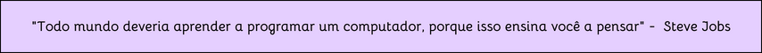

 

[+:%29)](https://git.io/typing-svg)

## 

 
  

 

##

  
 
  
  

##

 

<h3> TECNOLOGIAS QUE SEI: </h3>

<table align="center">
  <tr>
    <td align="center" width="96">
      
       HTML
    </td>
    <td align="center" width="96">
      
       CSS
    </td>
    <td align="center" width="96">
      
       JavaScript
    </td>
     <td align="center" width="96">
        
       C
    </td>
    <td align="center" width="96">
       
       Arduino
    </td>
    <td align="center" width="96">
      
       Bootstrap
    </td>
    <td align="center" width="96">
      
       Git
    </td>
    
</tr>
<tr>
    <td align="center" width="96">
       
       Php
    </td>
    <td align="center" width="96">
       
       Linux
    </td>
    <td align="center" width="96">
       
       Python
    </td>
    <td align="center" width="96">
        
       MYSQL
    </td>
    <td align="center" width="96">
      
       React
    </td>
    <td align="center" width="96">
      
       Github
    </td>
    <td align="center" width="96">
        
       MongoDB
    </td>  
</tr>
</table>

##

### REDES SOCIAIS: 

 
   
  

  

##

  
